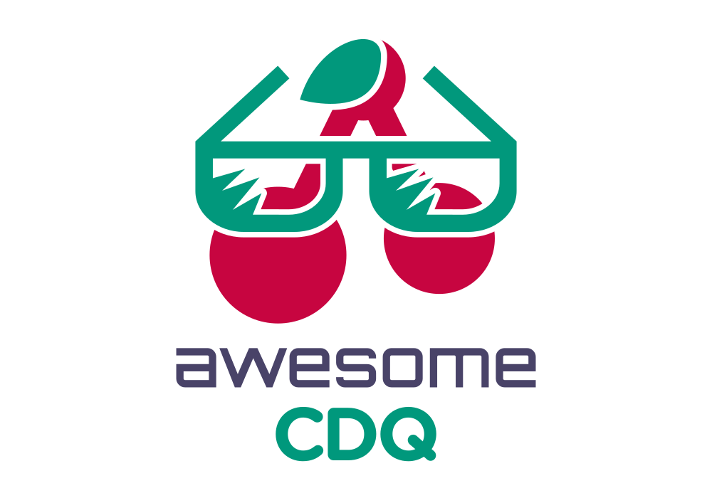

  

# Awesome CDQ

A curated list of awesome open source projects by [CDQ AG](https://www.cdq.com/). Inspired by the [awesome](https://github.com/sindresorhus/awesome) list thing.

## Table of Contents

- [GitHub Actions](#github-actions)
- [Terraform Providers](#terraform-providers)
- [DevOps Tools](#devops-tools)
- [Reusable Workflows](#reusable-workflows)

## GitHub Actions

### Workflow Control & Utilities

- [action-semver](https://github.com/cdqag/action-semver) - Automatic semantic versioning based on SemVer and Conventional Commits. Analyzes commit history and determines the next version number with support for pre-releases on feature branches.

- [action-normalize-version](https://github.com/cdqag/action-normalize-version) - Very simple GitHub Action that normalizes given version by ensuring it's prefixed with `v` and extracts the major version.

- [action-fail-on-rerun](https://github.com/cdqag/action-fail-on-rerun) - GitHub Action to fail a job if it has been re-run, useful for controlling retry behavior in workflows.

- [action-last-commit-info](https://github.com/cdqag/action-last-commit-info) - Retrieves comprehensive information about the last commit in a repository, including support for specific file paths without requiring repository checkout.

### Artifact & File Management

- [action-upload-to-nexus](https://github.com/cdqag/action-upload-to-nexus) - Upload given file(s) to a Nexus instance with flexible path mapping and glob pattern support.

- [action-download-artifacts](https://github.com/cdqag/action-download-artifacts) - Download all artifacts from a given workflow run with name pattern filtering and optional auto-unzip functionality.

- [action-download-repository-file](https://github.com/cdqag/action-download-repository-file) - Download a repository file from a given path without cloning the whole repository.

- [action-release-to-branch](https://github.com/cdqag/action-release-to-branch) - Automate the process of releasing (copying) selected files/directories to a specific branch, designed mainly for releasing custom GitHub Actions.

### Validation & Configuration

- [action-validate-yaml](https://github.com/cdqag/action-validate-yaml) - Composite action that validates a YAML file against JSON schema using jsonschema CLI.

- [action-argocd-app-health](https://github.com/cdqag/action-argocd-app-health) - GitHub Action that reports the health status of ArgoCD applications with detailed diagnostics for unhealthy resources including events, pod logs, and intelligent log parsing.

### Monitoring & Alerting

- [action-opsgenie-create-alert](https://github.com/cdqag/action-opsgenie-create-alert) - Create alerts in OpsGenie from GitHub Actions workflows with rich configuration options including responders, tags, priorities, and custom properties.

### Secrets Management

- [infisical-secrets-action](https://github.com/cdqag/infisical-secrets-action) - Inject Infisical secrets into GitHub workflows with support for OIDC and Universal Auth methods, exportable as environment variables or files.

### Helpers & Utilities

- [actions-helpers](https://github.com/cdqag/actions-helpers) - Reusable helpers for Bash-based GitHub Actions including job helpers, JSON helpers, log helpers, and YAML helpers.

## Terraform Providers

- [terraform-provider-jiracloud](https://github.com/cdqag/terraform-provider-jiracloud) - Terraform Provider for Jira Cloud with support for managing project components, including component leads as default assignees.

- [terraform-provider-githubcrypt](https://github.com/cdqag/terraform-provider-githubcrypt) - Terraform Provider GitHub Crypt for encrypting secrets locally and managing encrypted GitHub secrets at repository environment level.

## DevOps Tools

- [nexus-migrator](https://github.com/cdqag/nexus-migrator) - Tool for migrating artifacts between Sonatype Nexus repositories with support for Maven, Helm, PyPI, and Raw formats, including filtering by last downloaded date.

## Reusable Workflows

- [workflow-public](https://github.com/cdqag/workflow-public) - Collection of public reusable workflows for automating GitHub Actions processes including release actions and releasing files to specific branches.

---

## License

These projects are licensed under various open source licenses. Please refer to each project's repository for specific license information.

Contributions are welcome! For more information about CDQ AG, visit [www.cdq.com](https://www.cdq.com/).
